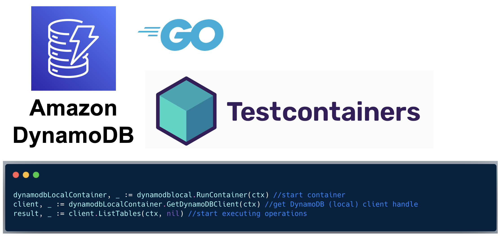

# Testcontainers module for DynamoDB Local



## Introduction

This module can be used to test your DynamoDB Go applications using Testcontainers.

[Testcontainers for Go](https://golang.testcontainers.org/) makes it simple to programmatically create and clean up container-based dependencies for automated integration/smoke tests. [DynamoDB Local](https://docs.aws.amazon.com/amazondynamodb/latest/developerguide/DynamoDBLocal.html) is a version of Amazon DynamoDB that you can run locally as a Docker container (or [other forms](https://docs.aws.amazon.com/amazondynamodb/latest/developerguide/DynamoDBLocal.DownloadingAndRunning.html)). 

## To add this module to your project dependencies

```shell
go get github.com/abhirockzz/dynamodb-local-testcontainers-go
```

## Getting started

You can use the example below to get started quickly. To run this:

```
go mod init demo
go get github.com/abhirockzz/dynamodb-local-testcontainers-go
go run main.go
```

The example:

1. Starts a Docker container - `dynamodblocal.RunContainer(ctx)`
2. Registers a function (defer) to terminate it at the end of the program - `dynamodbLocalContainer.Terminate(ctx)`
3. Gets the client handle for the DynamoDB (local) instance - `dynamodbLocalContainer.GetDynamoDBClient(context.Background())`
4. Uses the client handle to execute operations. In this case - create a table, add an item, query that item.

> Refer to [Module Options](#module-options) for additional configuration

```go
package main

import (
	"context"
	"log"

	dynamodblocal "github.com/abhirockzz/dynamodb-local-testcontainers-go"
	"github.com/aws/aws-sdk-go-v2/aws"
	"github.com/aws/aws-sdk-go-v2/service/dynamodb"
	"github.com/aws/aws-sdk-go-v2/service/dynamodb/types"
)

const (
	tableName    = "demo_table"
	pkColumnName = "demo_pk"
)

func main() {

	ctx := context.Background()

	dynamodbLocalContainer, err := dynamodblocal.RunContainer(ctx)
	if err != nil {
		log.Fatalf("failed to start container: %s", err)
	}

	// Clean up the container
	defer func() {
		if err := dynamodbLocalContainer.Terminate(ctx); err != nil {
			log.Fatalf("failed to terminate container: %s", err)
		}
	}()

	client, err := dynamodbLocalContainer.GetDynamoDBClient(context.Background())
	if err != nil {
		log.Fatal(err)
	}

	err = createTable(client)
	if err != nil {
		log.Fatal(err)
	}

	log.Println("dynamodb table created")

	result, err := client.ListTables(context.Background(), nil)
	if err != nil {
		log.Fatal(err)
	}

	actualTableName := result.TableNames[0]
	log.Println("table", actualTableName, "found")

	value := "test_value"
	err = addDataToTable(client, value)
	if err != nil {
		log.Fatal(err)
	}

	log.Println("added data to dynamodb table")

	queryResult, err := queryItem(client, value)
	if err != nil {
		log.Fatal(err)
	}

	log.Println("queried data from dynamodb table. result -", queryResult)
}

func createTable(client *dynamodb.Client) error {
	_, err := client.CreateTable(context.Background(), &dynamodb.CreateTableInput{
		TableName: aws.String(tableName),
		KeySchema: []types.KeySchemaElement{
			{
				AttributeName: aws.String(pkColumnName),
				KeyType:       types.KeyTypeHash,
			},
		},
		AttributeDefinitions: []types.AttributeDefinition{
			{
				AttributeName: aws.String(pkColumnName),
				AttributeType: types.ScalarAttributeTypeS,
			},
		},
		BillingMode: types.BillingModePayPerRequest,
	})

	if err != nil {
		return err
	}

	//log.Println("created table")
	return nil
}

func addDataToTable(client *dynamodb.Client, val string) error {

	_, err := client.PutItem(context.Background(), &dynamodb.PutItemInput{
		TableName: aws.String(tableName),
		Item: map[string]types.AttributeValue{
			pkColumnName: &types.AttributeValueMemberS{Value: val},
		},
	})

	if err != nil {
		return err
	}

	return nil
}

func queryItem(client *dynamodb.Client, val string) (string, error) {

	output, err := client.GetItem(context.Background(), &dynamodb.GetItemInput{
		TableName: aws.String(tableName),
		Key: map[string]types.AttributeValue{
			pkColumnName: &types.AttributeValueMemberS{Value: val},
		},
	})

	if err != nil {
		return "", err
	}

	result := output.Item[pkColumnName].(*types.AttributeValueMemberS)

	return result.Value, nil
}
```

## Module options

The following configuration parameters are supported: `WithSharedDB` and `WithTelemetryDisabled`.

**WithSharedDB**

```
container, err := dynamodblocal.RunContainer(ctx, WithSharedDB())
```

If you use this option, DynamoDB creates a shared database file in which data is stored. This is useful if you want to persist data for e.g. between successive test executions. See [TestIntegrationWithSharedDB in dynamodb_test.go](dynamodb_test.go) for reference.

**WithTelemetryDisabled**

```
container, err := dynamodblocal.RunContainer(ctx, WithTelemetryDisabled())
```

When specified, DynamoDB local will not send any telemetry.

To use these options together:

```go
container, err := dynamodblocal.RunContainer(ctx, WithSharedDB(), WithTelemetryDisabled())
```